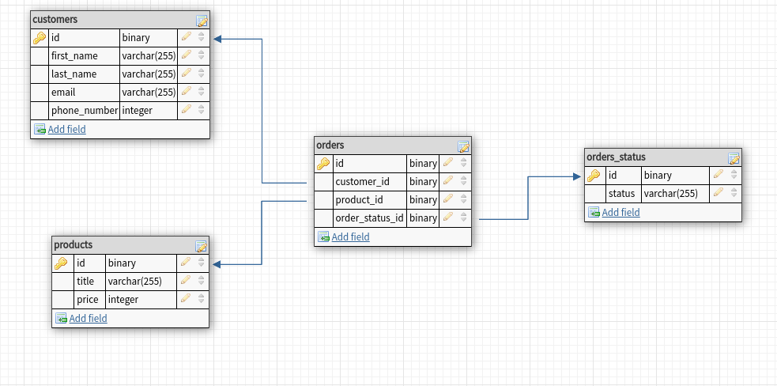

# Завдання

У вас є задача створити CRM систему.
А саме говоримо зараз про сутність Замовлення (Order).

У замовлень може бути безліч статусів - Нове, В роботі, Завершено і т.п.

Ці статуси можуть динамічно додаватись з адмін панелі.

У Замовлень є певний набір полів, який можна змінювати (типу сума замовлення, дата, дані на кого оформлений і тп)

І є задача під певні статуси зробити автоматизацію. Візьмемо для прикладу 2 статуси:
1) На статус Нове Замовлення відправляти СМС клієнту.
2) На статус Відміна відправляти по АПІ запит, що була Відміна (сам запит зараз не цікавить технічно, це буде запит до 1С).

1) Як ви реалізуєте Модель Замовлень і Статусів ?
2) Як ви налагодите опрацювання таких автоматизацій?


# Відповідь

## Як ви реалізуєте Модель Замовлень і Статусів ?

Щоб простіше розібратися з моделлю зв'язків між «Замовленням і Статусом»
реалізуємо простий приклад схеми взаємозв'язків БД, який даватиме можливість динамічно управляти статусами замовлення (додавати нові статуси чи видаляти старі).

<p align="center"><a target="_blank"></a></p>

Модель взаємозв'язків між orders і orders_status представлена у вигляді One To Many (один статус може відповідати зразу багатьом замовленням, а замовлення може мати лише один статус)


Приклад реалізацій моделей на Laravel:

=> Models/Order.php

=> Models/OrderStatus.php

## Як ви налагодите опрацювання таких автоматизацій?
1) На статус Нове Замовлення відправляти СМС клієнту.

Зазвичай відправлення смс повідомлень є платним сервісом, тому реалізація буде залежати від технічного завдання замовника.
Як варіант можна використовувати сервіс - Vonage (Nexmo) його реалізація вже частково вбудована в Laravel,
потрібно лише зробити додаткові налаштування згідно з документацією і провести реєстрацію на самому сервісі.
Якщо буде стояти завдання вибрати інший сервіс, то тут потрібно використовувати API вибраного сервісу.
Я б виправляння API запиту зробив  в окремому Класі (HandlerSms)
І за допомогою dependency inversion та interface зробив би мінімальну залежність між основним моїм класом (ServiceOrders)
і HandlerSms. Це в майбутньому спростить роботу з тестуванням і переходом на інший сервіс смс повідомлень, якщо виникне необхідність.
Ініціалізацію роботи HandlerSms розпочинав би після того, як отримаю підтвердження (TRUE) про створення нового замовлення і присвоєння
відповідного статусу замовленню.

2) На статус Відміна відправляти по АПІ запит, що була Відміна (сам запит зараз не цікавить технічно, це буде запит до 1С).

Аналогічно до попередньої частини реалізацію сервісу API виконав би в окремому класі з використанням dependency inversion та interface.
Але на мою думку тут потрібно звернути увагу на те, щоб і зміна статусу замовлення в базі та відправлений запроси по API були виконані.
(ми не можемо допустити, щоб через якусь причину стався роз синхрон: запит по API відпрацював, а запис до бази ні, чи навпаки)

Тому щоб розв'язувати цю проблему я спробував би використати конструкцію

```sh
DB::transaction(function()  {

        });
```
і вже в ній викликав би спочатку запис до бази про зміну статусу замовлення, а вже потім викликав би сервіс API який повинен повертати true або false.
Якщо у нас API сервіс повертає false, то автоматично відбувається відміна транзакції.

Також потрібно враховувати, що при використанні transaction ми блокуємо доступ до відповідних даних.
